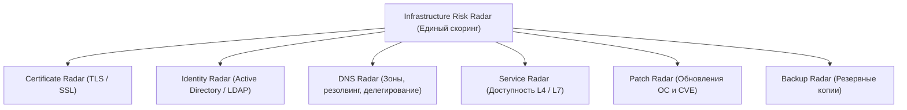

# Презентация проекта: Certificate Radar

Платформа централизованного обнаружения, инвентаризации и контроля цифровых сертификатов.
Тематика: **«Автоматизация и повышение надёжности корпоративной инфраструктуры»**.

---

## Слайд 1. Титульный
- **Заголовок**: Certificate Radar
- **Подзаголовок**: Централизованное выявление и риск-ориентированный контроль цифровых сертификатов
- **Ключевой девиз**: *«Обнаружить проблему до того, как она станет инцидентом»*
- **Тезис спикера**: В современных корпоративных сетях тысячи сервисов используют TLS. Но даже в зрелых организациях сертификаты продолжают истекать, вызывая простои бизнеса, падение платежей и компрометацию доверия. Certificate Radar решает эту проблему автоматически и безопасно.

---

## Слайд 2. Боль и проблематика корпоративной инфраструктуры
- **Анатомия типичного инцидента**:
  1. *Отсутствие единого инвентаря*: сертификаты выпускаются разными отделами, часть забывается.
  2. *«Слепые зоны»*: внутренние сервисы, тестовые среды, сетевые устройства, нестандартные порты.
  3. *Ошибки конфигурации*: несоответствие DNS-имени (CN/SAN mismatch), неполные цепочки сертификатов, слабые ключи (RSA 1024, SHA-1).
  4. *Информационный шум*: бесконечные уведомления, которые игнорируются, пока сервис не откажет.
- **Бизнес-риски**:
  - Недоступность критических бизнес-систем (CRM, OWA, VPN, API).
  - Утечка репутации и предупреждения безопасности в браузерах клиентов.
  - Потеря времени инженеров на авральное устранение аварий.

---

## Слайд 3. Наше решение: Certificate Radar
- **Что делает система**:
  - Автоматически находит и опрашивает TLS-сервисы по всему пулу адресов (DNS, IP, URL, CIDR-диапазоны).
  - Считывает все атрибуты листового сертификата и строит полную цепочку доверия.
  - Оценивает интегральный **Risk Score (0–100)** с приоритизацией от Critical до Low.
  - Генерирует однозначные статические рекомендации администраторам по устранению дефектов.
  - Отправляет таргетированные уведомления ответственным владельцам без дублей.

---

## Слайд 4. Ключевые возможности и функционал
1. **Всеядный импорт с валидацией**:
   - Поддержка FQDN, IP, портов, URL и сетевых масок (CIDR /24).
   - Автоматическая дедупликация и защита от синтаксических ошибок.
2. **Высокоскоростное параллельное сканирование**:
   - `ThreadPoolExecutor` без блокировки веб-сервера.
   - Изоляция сетевых сбоев: недоступный сервис маркируется `Unreachable`, не останавливая общий скан.
3. **Глубокий криптографический и структурный анализ**:
   - Проверка срока действия с настраиваемыми порогами (OK, Information, Warning, Critical, Expired).
   - Проверка соответствия имени (RFC 1123, wildcard `*.domain.com`, IP SAN).
   - Верификация цепочки сертификатов с поддержкой корпоративных Root CA.
   - Детекция Self-signed и устаревших криптографических параметров (RSA < 2048, MD5/SHA-1).
4. **Удобный Executive Dashboard**:
   - Индекс надёжности инфраструктуры (**Health Score**).
   - Сводка технических рисков (цепочки, mismatch, слабые ключи, отсутствие владельца).
   - Таблица ближайших окончаний и сервисов, требующих немедленного внимания.

---

## Слайд 5. Архитектура и безопасность (Enterprise Ready)
- **Строгий режим Read Only**:
  - Никаких HTTP-запросов, логинов, паролей или изменений на целевых хостах.
  - Только стандартное сетевое TLS-рукопожатие.
- **Модульность (Plugin-ready)**:
  - Каждая проверка изолирована в модуле `radar/checks/` (Expiry, Chain, Hostname, SelfSigned, Crypto, Owner).
  - Добавление новой проверки требует лишь одного файла и регистрации в реестре `ALL_CHECKS`.
- **Независимость бизнес-логики**:
  - Изменение регламентных порогов срока действия (`/settings`) мгновенно пересчитывает статусы всей базы без повторного сканирования.
- **Журнал аудита**:
  - Фиксация всех действий (импорт, сканирование, смена настроек, выгрузка отчётов).

---

## Слайд 6. Оповещения и отчётность
- **Умная доставка уведомлений**:
  - Поддержка каналов: Системная консоль, Корпоративный SMTP (Email), Telegram Bot.
  - Оповещение по порогам: 60, 30, 14, 7 и 1 день (а также статус Expired).
  - **Защита от спама**: уникальный индекс `(thumbprint, threshold, channel)` исключает повторную отправку одного и того же предупреждения.
- **Мультиформатный экспорт в 1 клик**:
  - **CSV**: UTF-8 с BOM для прямого открытия в Excel.
  - **XLSX**: полноценный Excel с автофильтрами, закреплённой шапкой и цветовой подсветкой рисков.
  - **HTML**: автономный отчёт для отправки топ-менеджменту и ИБ-аудиторам.

---

## Слайд 7. Стратегическое видение: Infrastructure Risk Radar
Certificate Radar — это фундамент для создания единой зонтичной платформы управления техническими рисками:

- **Синергия с Identity Risk Analyzer**:
  - Учётные записи администраторов PKI и сервисные аккаунты Active Directory связываются с владельцами сертификатов.
  - Единая сводка рисков компании на одном экране.

---

## Слайд 8. Результаты и соответствие требованиям Хакатона
| Требование ТЗ (Раздел 3.11) | Реализация в Certificate Radar | Статус |
|---|---|---|
| Загрузка списка DNS/IP/URL/CIDR | CSV, TXT, ручной ввод с валидацией | **100% Выполнено** |
| Параллельный сбор TLS | Порт 443 + кастомные порты, ThreadPool | **100% Выполнено** |
| Получение атрибутов сертификата | CN, SAN DNS/IP, Issuer, Thumbprint, даты, ключ, TLS | **100% Выполнено** |
| Расчёт срока и Days Left | Точный расчёт с настраиваемыми порогами | **100% Выполнено** |
| Проверка соответствия DNS-имени | Полная проверка RFC, wildcard и IP SAN | **100% Выполнено** |
| Базовая проверка цепочки доверия | Верификация цепочки и детекция Self-Signed | **100% Выполнено** |
| Присвоение статусов | OK, Information, Warning, Critical, Expired, Unreachable | **100% Выполнено** |
| Web Dashboard и карточка | Индекс здоровья, фильтры, сортировка, рекомендации | **100% Выполнено** |
| Экспорт отчёта | CSV с BOM, стилизованный XLSX, автономный HTML | **100% Выполнено** |
| Уведомления | 60/30/14/7/1 дни, дедупликация, Console/Email/Telegram | **100% Выполнено** |
| Дополнительно | Risk Score (0-100), журнал аудита, режим Read-Only | **100% Выполнено** |

---

## Вопросы и ответы (Q&A для жюри)
1. **Вопрос**: *Насколько безопасно запускать сканер в продуктивной корпоративной сети?*
   - **Ответ**: Сканер работает строго в режиме Read Only: выполняет только стандартное TCP-подключение и TLS-рукопожатие. Он не отправляет HTTP-запросов к приложению, не передаёт учётные данные и не изменяет конфигурацию серверов.
2. **Вопрос**: *Что произойдёт, если изменится корпоративная политика (например, критический срок станет 7 дней вместо 14)?*
   - **Ответ**: Администратор меняет значение в меню «Настройки». Все сохранённые сертификаты мгновенно пересчитываются локально за 0.1 секунды без нагрузки на сеть.
3. **Вопрос**: *Как решение интегрируется в существующую экосистему ИБ?*
   - **Ответ**: Предусмотрен полный JSON REST API (эндпоинты `/api/results`, `/api/scans`, `/api/dashboard`, `/api/services`), экспорт в машиночитаемые форматы и интеграция с Telegram/Email.
